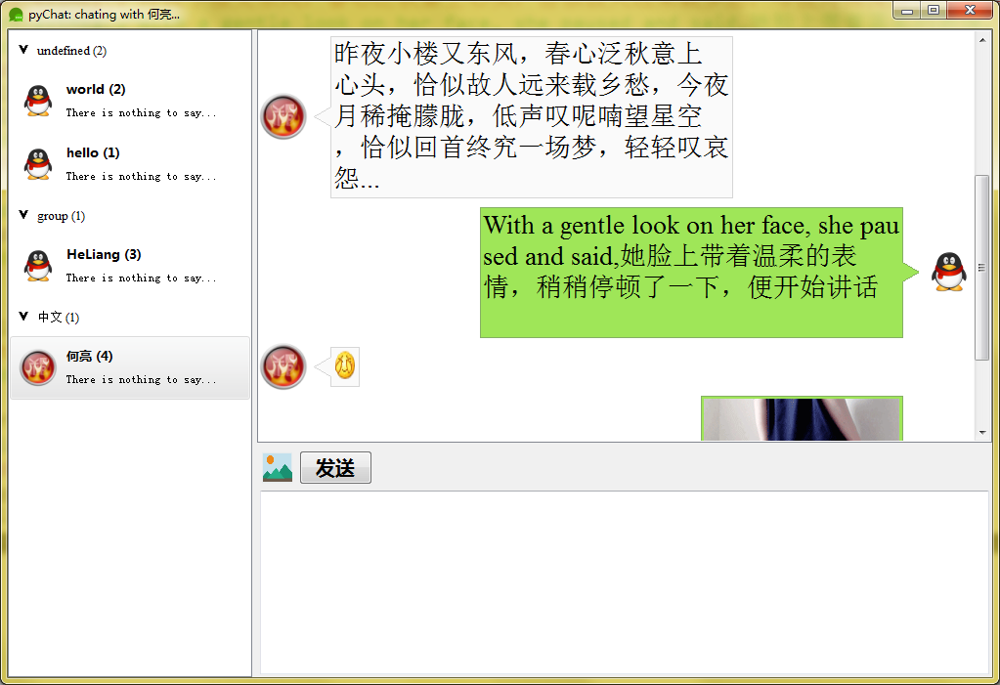

[TOC]

# 需求

1. 实现聊天界面的综合，主要是包含好友列表、聊天窗口和输入窗口。
2. 包含图片收发按钮，发送可以按ctrl+回车，双击好友和其聊天。

# 实现效果

 

# 实现思路

1. 好友列表（[groupUserList](groupUserList_readme.md)）和消息列表（[msgList](msgList_readme.md)）都在前面实现好了，这里直接调用即可。
2. 输入列表需要一个简单的QTextEdit即可，但是为了支持ctrl+return发送消息，还是简单的继承并复写了keyPressEvent事件，然后判断`(e.key() == Qt.Key_Return) and (e.modifiers() == Qt.ControlModifier)`即按下ctrl+enter时发送消息并清空内容。
3. 消息输入控件MsgInput还需要一个可以输入图片的按钮，和后期可能增加的其它文件、表情等，因此调用了系统的demo里面的一个flowlayout类实现控件的从左到右自动排列放置图片按钮和发送按钮。并在各自的按钮上输出两个信号，textEntered发射输入文字，imgEntered发射输入图片。
>其中图片按钮采用setStyleSheet设置其border-image即可实现显示图片效果。为了让其鼠标滑过时效果不同设置如下样式：`setStyleSheet("QPushButton{border-image:url(icons/img.png);}""QPushButton:hover{border: 2px groove blue;}""QPushButton:pressed{border-style: inset;}")`
4. 为了在界面上可以手动调节，将主界面继承到QSplitter，设置合理的添加位置保证控件的区域即可。将MsgInput中发射的信号绑定到本例的槽函数调用msgList实例添加消息。
~~5. 为了双击用户可以设置聊天对象，因此修改groupUserList里面的UserItem在mouseDoubleClickEvent时发射doubleClicked信号 -> 在UserListItem中将其绑定到父控件的自定义消息发射函数。~~
5. 将GroupUserList的实例itemDoubleClicked信号绑定到PyqtChatApp的setChatUser槽。获取双击用户的各种信息然后保存到本类中，用户增加消息时的使用。

#undo 

1. 聊天后台和功能实现。

项目地址：https://github.com/HeLiangHIT/pyqtChat
博客地址：http://blog.csdn.net/u010151698